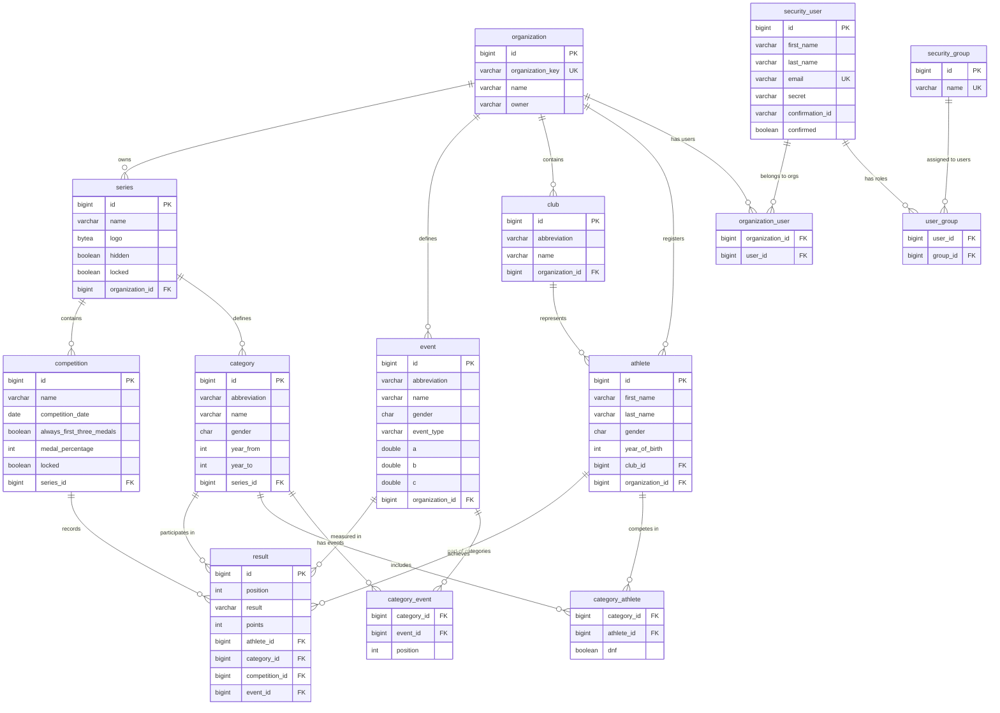

# JTAF Database Schema

This document contains the entity relationship diagram for the JTAF (Track and Field) application database.

## Database Schema Overview

The JTAF database is designed to support multi-tenant track and field competition management with the following key entities:

- **Organizations** - Top-level entities that own competitions and define events
- **Series** - Collections of related competitions within an organization
- **Competitions** - Individual track and field events with specific dates
- **Categories** - Age/gender-based groupings for athletes
- **Athletes** - Participants with club affiliations
- **Events** - Specific disciplines (100m sprint, long jump, shot put, etc.)
- **Results** - Performance data with automatic point calculations using IAAF formulas

## Entity Relationship Diagram

## Key Tables Description

### Core Competition Tables
- **organization**: Multi-tenant support with unique organization keys
- **series**: Groups related competitions (e.g., annual championship series)
- **competition**: Individual track and field events with dates and medal settings
- **category**: Age/gender groupings (e.g., "Boys U12", "Girls U14")
- **event**: Track and field disciplines with IAAF scoring coefficients (a, b, c)

### Participant Tables
- **athlete**: Competition participants with club affiliations
- **club**: Sports clubs that athletes represent
- **result**: Performance records linking athletes, events, categories, and competitions

### Security Tables
- **security_user**: Application users with authentication details
- **security_group**: Role-based access control groups
- **organization_user**: Many-to-many relationship for user-organization membership
- **user_group**: Many-to-many relationship for user-role assignments

### Junction Tables
- **category_athlete**: Links athletes to categories with DNF (Did Not Finish) flag
- **category_event**: Links events to categories with positioning information

## IAAF Scoring System

The `event` table contains coefficients (a, b, c) used in IAAF scoring formulas to convert raw performance results into standardized points:

- **RUN**: Short distance events - `points = a * ((b - time_in_centiseconds) / 100)^c`
- **RUN_LONG**: Long distance events - `points = a * ((b - time_in_centiseconds) / 100)^c`
- **JUMP_THROW**: Field events - `points = a * ((distance_in_centimeters - b) / 100)^c`

This ensures fair comparison across different disciplines in multi-event competitions.