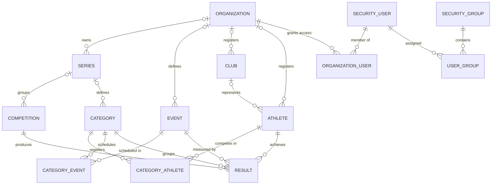

# Entity Model

## Entity Relationship Diagram

### ORGANIZATION

Top-level multi-tenant container that owns all athletics data and grants user access.

| Attribute        | Description                                          | Data Type | Length/Precision | Validation Rules      |
|------------------|------------------------------------------------------|-----------|------------------|-----------------------|
| id               | Unique identifier                                    | Long      | 19               | Primary Key, Sequence |
| organization_key | Short, URL-friendly key used to identify the tenant  | String    | 255              | Not Null, Unique      |
| name             | Display name of the organization                     | String    | 255              | Not Null              |
| owner            | E-mail of the user who created the organization      | String    | 255              | Not Null              |

### SECURITY_USER

Application user account that authenticates with e-mail and password.

| Attribute       | Description                                              | Data Type | Length/Precision | Validation Rules      |
|-----------------|----------------------------------------------------------|-----------|------------------|-----------------------|
| id              | Unique identifier                                        | Long      | 19               | Primary Key, Sequence |
| first_name      | Given name                                               | String    | 255              | Not Null              |
| last_name       | Family name                                              | String    | 255              | Not Null              |
| email           | E-mail address used as login                             | String    | 255              | Not Null, Unique, Format: Email |
| secret          | Hashed password                                          | String    | 255              | Not Null              |
| confirmation_id | Token sent by e-mail to verify the address               | String    | 255              | Optional              |
| confirmed       | True once the account has been confirmed via e-mail link | Boolean   | 1                | Optional in DDL, Default: false |

### SECURITY_GROUP

Role grouping (e.g. USER, ADMIN) used by Spring Security authorities.

| Attribute | Description                       | Data Type | Length/Precision | Validation Rules      |
|-----------|-----------------------------------|-----------|------------------|-----------------------|
| id        | Unique identifier                 | Long      | 19               | Primary Key, Sequence |
| name      | Group / role name (USER \| ADMIN) | String    | 255              | Not Null, Unique, Values: USER, ADMIN |

### SERIES

Collection of related competitions within an organization, typically a season.

| Attribute       | Description                                      | Data Type | Length/Precision | Validation Rules                   |
|-----------------|--------------------------------------------------|-----------|------------------|------------------------------------|
| id              | Unique identifier                                | Long      | 19               | Primary Key, Sequence              |
| name            | Series name                                      | String    | 255              | Not Null                           |
| logo            | Binary logo used on reports                      | Binary    | -                | Optional                           |
| hidden          | Hides the series from the public dashboard       | Boolean   | 1                | Not Null                           |
| locked          | Prevents further modifications                   | Boolean   | 1                | Not Null                           |
| organization_id | Owning organization                              | Long      | 19               | Foreign Key (ORGANIZATION.id)      |

**Constraints:** `organization_id` is nullable in the DDL but required by the application — every series is created within an organization.

### COMPETITION

Single track-and-field event held on a specific date inside a series.

| Attribute                 | Description                                            | Data Type | Length/Precision | Validation Rules                |
|---------------------------|--------------------------------------------------------|-----------|------------------|---------------------------------|
| id                        | Unique identifier                                      | Long      | 19               | Primary Key, Sequence           |
| name                      | Competition name                                       | String    | 255              | Not Null                        |
| competition_date          | Date the competition is held                           | Date      | -                | Not Null                        |
| always_first_three_medals | When true, the top three athletes always get medals    | Boolean   | 1                | Not Null                        |
| medal_percentage          | Share of athletes per category awarded a medal (0-100) | Integer   | 10               | Not Null, Min: 0, Max: 100      |
| locked                    | Prevents result changes after the competition is over  | Boolean   | 1                | Not Null                        |
| series_id                 | Owning series                                          | Long      | 19               | Foreign Key (SERIES.id)         |

**Constraints:** `series_id` is nullable in the DDL but required by the application — every competition is created bound to a series. The 0-100 range of `medal_percentage` is enforced by the UI (`IntegerRangeValidator` in `CompetitionDialog`), not by a database check.

### CATEGORY

Age and gender bracket inside a series that an athlete competes in.

| Attribute    | Description                                       | Data Type | Length/Precision | Validation Rules                     |
|--------------|---------------------------------------------------|-----------|------------------|--------------------------------------|
| id           | Unique identifier                                 | Long      | 19               | Primary Key, Sequence                |
| abbreviation | Short label used on reports (e.g. "M14")          | String    | 255              | Not Null                             |
| name         | Long descriptive name                             | String    | 255              | Not Null                             |
| gender       | Allowed gender                                    | String    | 1                | Not Null, Values: M, F               |
| year_from    | Earliest birth year accepted (inclusive)          | Integer   | 10               | Not Null                             |
| year_to      | Latest birth year accepted (inclusive)            | Integer   | 10               | Not Null                             |
| series_id    | Owning series                                     | Long      | 19               | Foreign Key (SERIES.id)              |

**Constraints:** By convention `year_from` is less than or equal to `year_to`; this is not enforced by the database or the UI. `series_id` is nullable in the DDL but required by the application.

### EVENT

Discipline definition (e.g. 100m sprint, long jump) with the IAAF scoring coefficients.

| Attribute       | Description                                                | Data Type | Length/Precision | Validation Rules                            |
|-----------------|------------------------------------------------------------|-----------|------------------|---------------------------------------------|
| id              | Unique identifier                                          | Long      | 19               | Primary Key, Sequence                       |
| abbreviation    | Short label used on reports                                | String    | 255              | Optional in DDL, required by application    |
| name            | Discipline name                                            | String    | 255              | Optional in DDL, required by application    |
| gender          | Gender the event is intended for                           | String    | 1                | Optional in DDL, Values: M, F               |
| event_type      | Scoring family used to interpret the result and award points | String  | 255              | Optional in DDL, required by application, Values: RUN, RUN_LONG, JUMP_THROW |
| a               | IAAF scoring coefficient A                                 | Double    | -                | Not Null                                    |
| b               | IAAF scoring coefficient B                                 | Double    | -                | Not Null                                    |
| c               | IAAF scoring coefficient C                                 | Double    | -                | Not Null                                    |
| organization_id | Owning organization                                        | Long      | 19               | Foreign Key (ORGANIZATION.id)               |

**Constraints:** `organization_id` is nullable in the DDL but required by the application. `abbreviation`, `name`, `gender` and `event_type` are also nullable in the DDL; `abbreviation`, `name` and `event_type` are validated as required in the UI (`EventDialog`), while `gender` only carries a required indicator without a validator.

### CLUB

Sports club an athlete is registered with for ranking purposes.

| Attribute       | Description                              | Data Type | Length/Precision | Validation Rules                        |
|-----------------|------------------------------------------|-----------|------------------|-----------------------------------------|
| id              | Unique identifier                        | Long      | 19               | Primary Key, Sequence                   |
| abbreviation    | Short label used on reports              | String    | 255              | Not Null                                |
| name            | Full club name                           | String    | 255              | Not Null                                |
| organization_id | Owning organization                      | Long      | 19               | Foreign Key (ORGANIZATION.id)           |

**Constraints:** `organization_id` is nullable in the DDL but required by the application.

### ATHLETE

Person participating in competitions, registered to a single organization.

| Attribute       | Description                                  | Data Type | Length/Precision | Validation Rules                        |
|-----------------|----------------------------------------------|-----------|------------------|-----------------------------------------|
| id              | Unique identifier                            | Long      | 19               | Primary Key, Sequence                   |
| first_name      | Given name                                   | String    | 255              | Not Null                                |
| last_name       | Family name                                  | String    | 255              | Not Null                                |
| gender          | Gender (used to match categories)            | String    | 1                | Not Null, Values: M, F                  |
| year_of_birth   | Birth year (used for age bracket matching)   | Integer   | 10               | Not Null                                |
| club_id         | Club the athlete represents                  | Long      | 19               | Optional, Foreign Key (CLUB.id)         |
| organization_id | Owning organization                          | Long      | 19               | Foreign Key (ORGANIZATION.id)           |

**Constraints:** `organization_id` is nullable in the DDL but required by the application.

### RESULT

Performance recorded for an athlete in one event of one competition.

| Attribute      | Description                                                       | Data Type | Length/Precision | Validation Rules                          |
|----------------|-------------------------------------------------------------------|-----------|------------------|-------------------------------------------|
| id             | Unique identifier                                                 | Long      | 19               | Primary Key, Sequence                     |
| position       | Display order of the event for that athlete (matches CATEGORY_EVENT.position) | Integer | 10        | Not Null                                  |
| result         | Raw measured value (RUN: "ss.cc"; RUN_LONG: "mm.ss"; JUMP_THROW: metres, e.g. "3.11") | String    | 255              | Not Null                                  |
| points         | Points calculated from the result with the IAAF formula           | Integer   | 10               | Not Null, Min: 0                          |
| athlete_id     | Athlete the result belongs to                                     | Long      | 19               | Not Null, Foreign Key (ATHLETE.id)        |
| category_id    | Category the result counts toward                                 | Long      | 19               | Not Null, Foreign Key (CATEGORY.id)       |
| competition_id | Competition the result was achieved at                            | Long      | 19               | Not Null, Foreign Key (COMPETITION.id)    |
| event_id       | Event measured                                                    | Long      | 19               | Not Null, Foreign Key (EVENT.id)          |

**Constraints:** Uniqueness per (athlete_id, competition_id, category_id, event_id) is a convention maintained by the result-entry UI; there is no database constraint enforcing it.

### CATEGORY_ATHLETE

Junction recording an athlete's enrolment in a category for a series.

| Attribute   | Description                                                | Data Type | Length/Precision | Validation Rules                     |
|-------------|------------------------------------------------------------|-----------|------------------|--------------------------------------|
| category_id | Category the athlete competes in                           | Long      | 19               | Primary Key, Foreign Key (CATEGORY.id) |
| athlete_id  | Enrolled athlete                                           | Long      | 19               | Primary Key, Foreign Key (ATHLETE.id)  |
| dnf         | True when the athlete is flagged "Did Not Finish" for this category (series-scoped) | Boolean | 1 | Not Null                             |

**Constraints:** Composite primary key (athlete_id, category_id).

### CATEGORY_EVENT

Junction defining which events a category contests, in which order.

| Attribute   | Description                                  | Data Type | Length/Precision | Validation Rules                       |
|-------------|----------------------------------------------|-----------|------------------|----------------------------------------|
| category_id | Category the event belongs to                | Long      | 19               | Primary Key, Foreign Key (CATEGORY.id) |
| event_id    | Event scheduled                              | Long      | 19               | Primary Key, Foreign Key (EVENT.id)    |
| position    | Display / contest order inside the category  | Integer   | 10               | Not Null, Min: 0                       |

**Constraints:** Composite primary key (category_id, event_id).

### ORGANIZATION_USER

Junction granting a user access to an organization's data.

| Attribute       | Description           | Data Type | Length/Precision | Validation Rules                          |
|-----------------|-----------------------|-----------|------------------|-------------------------------------------|
| organization_id | Organization granted  | Long      | 19               | Primary Key, Foreign Key (ORGANIZATION.id) |
| user_id         | User granted access   | Long      | 19               | Primary Key, Foreign Key (SECURITY_USER.id) |

**Constraints:** Composite primary key (organization_id, user_id).

### USER_GROUP

Junction assigning a security group (role) to a user.

| Attribute | Description     | Data Type | Length/Precision | Validation Rules                            |
|-----------|-----------------|-----------|------------------|---------------------------------------------|
| user_id   | User assigned   | Long      | 19               | Primary Key, Foreign Key (SECURITY_USER.id) |
| group_id  | Group / role    | Long      | 19               | Primary Key, Foreign Key (SECURITY_GROUP.id) |

**Constraints:** Composite primary key (group_id, user_id).

## IAAF Scoring Formulas

The coefficients `a`, `b`, `c` on `EVENT` feed the standard IAAF point formulas. `RESULT.result` is parsed according to the event's `event_type` and the points are stored in `RESULT.points`:

| event_type | Result format                                             | Formula                                                      |
|------------|-----------------------------------------------------------|--------------------------------------------------------------|
| RUN        | `ss.cc` (seconds and centiseconds, e.g. `12.34`)          | `points = a * ((b - time_in_centiseconds) / 100) ^ c`        |
| RUN_LONG   | `mm.ss` (minutes and seconds separated by a dot, e.g. `2.15` = 2 min 15 s; no centiseconds) | `points = a * ((b - time_in_centiseconds) / 100) ^ c` |
| JUMP_THROW | metres (e.g. `3.11`), converted to centimetres internally | `points = a * ((distance_in_centimeters - b) / 100) ^ c`     |

Calculated points are clamped at zero (`ResultCalculator` returns 0 for NaN or negative values), so an underperforming athlete never receives a negative score.
